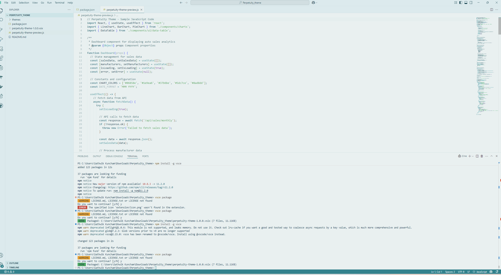
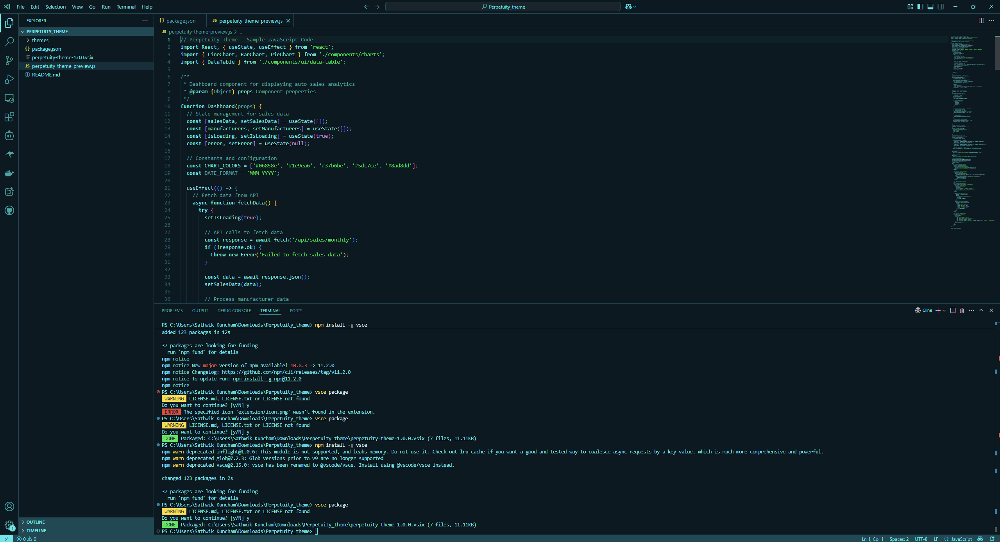

# Perpetuity Theme for Visual Studio Code

A modern, clean Visual Studio Code theme with teal accents designed for optimal readability and reduced eye strain. Perpetuity offers both light and dark variants to match your preferences and working environment.

## 📷 Screenshots

### Perpetuity Light

### Perpetuity Dark

*Color palette inspired by [tweakcn Theme Editor](https://tweakcn.com/editor/theme).*

## 🚀 Installation

1. Open **Extensions** sidebar in VS Code (`Ctrl+Shift+X` or `Cmd+Shift+X`)
2. Search for `Perpetuity Theme`
3. Click **Install**
4. Click **Reload** to reload VS Code
5. Select the theme via **File > Preferences > Color Theme > Perpetuity Light** or **Perpetuity Dark**

## 📝 Feedback

If you have suggestions or encounter any issues, please [open an issue](https://github.com/yourusername/perpetuity-theme/issues).

## 📜 License

This theme is released under the [MIT License](LICENSE).

---

**Enjoy coding with Perpetuity!** 💻✨
